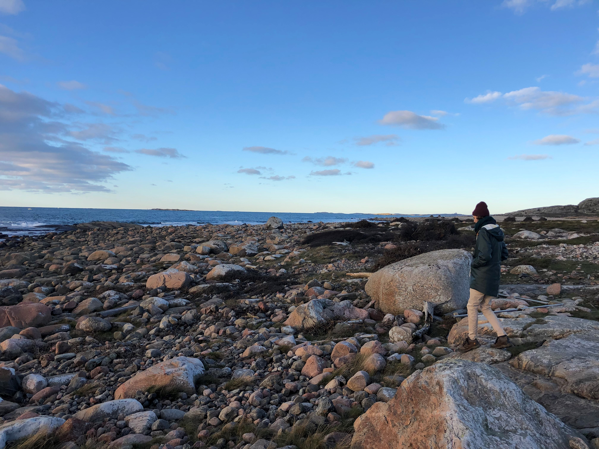

<style>
header {
  color: #000000;
  background-color: #708090;
  opacity: 0.6;
  font-family: Calibri;
  font-size: 14px;
}
body {
  color: #000000;
  font-family: Calibri;
  background-color: #F5F5F5;
}
pre {
  color: #708090;
  background-color: #F8F8FF;
}
</style>

<br>

#### ABOUT ME

I'm a ecologist/biologist by training with a fondness for data science and statistics. My favourite tools are R and Stan.  

I took a *BSc* with a major in *Ecology and Evolution* from the University of Cape Town, South Africa (my home town). From then, I completed an *MSc* in Tropical Biology on an Erasmus Mundus scholarship before starting my current position as a a PhD student at the University of Gothenburg in Sweden.
<br>
<br>

```{r, out.width="50%", echo=FALSE}

```
<br>
<br>
*Caption: A cold South African in beautiful Gothenburg, Sweden (2021)*


